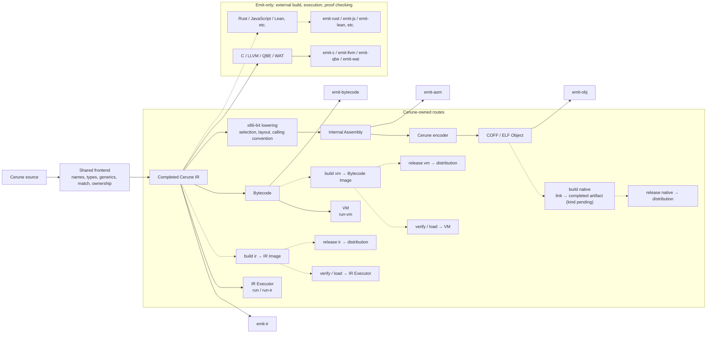

# Execution routes and build / release responsibilities

[日本語](owned-routes.ja.md) · [Issue #81](https://github.com/Hokutaka/Cerune/issues/81)

## Decision and status

IR, VM, and Native are the three routes for which Cerune defines completed artifacts and execution contracts.
`build` constructs an artifact usable by its route; `release` prepares it for distribution.
Neither operation selects an execution strategy or enables implicit optimization.

Current commands include `run` / `run-ir`, `run-vm`, and `emit-*`.
**Build / release, saved Image loading, and the Lean backend are not implemented.**
Dashed edges below are planned. Language coverage remains a separate concern; dynamic arrays currently execute only in IR and VM.

## Route diagram

Execution and Image construction branch independently: building does not run the program.
The current object encoder consumes internal Assembly. This diagram does not require an external assembler or claim an unimplemented machine IR exists.

## Operations and completed artifacts

| Operation | Contract |
| --- | --- |
| `emit-*` | Explicitly expose a representation at one stage for observation or downstream processing; it need not be a completed artifact |
| Planned `build ir` / `build vm` | Construct a loadable Image with format/semantics versions, entry point, required definitions, resource contract, and origins |
| Planned `build native` | Construct the Native route's completed artifact using an explicit target and tool selection |
| Planned `release` | Package that artifact, required dependencies, manifest, and compatibility conditions for distribution |

Generation code may be shared. Simply renaming textual `.ceir` / `.cebc` output or an object is not build.
Current observation text is not promised as a stable input format. Image extensions, containers, and compatibility versioning remain loader design decisions.

IR and VM artifacts need compatible runtimes. Bundling a runtime versus requiring one from the environment must be an explicit distribution choice.
An **executable is proposed** as the first Native completed artifact; linking would then be mandatory.
Libraries would be a distinct artifact kind. That choice and the external linker contract remain open.

## External tools

C, LLVM, QBE, WAT, and future Rust, JavaScript, and Lean are emit-only.
Their compilers, runtimes, and proof checkers are not managed by the normal Cerune CLI.
**Cerune remains responsible for preserving IR semantics in generated output and testing that preservation.**
Lean follows the same boundary for [semantic correspondence and program properties](lean-verification.en.md).

Native stays Cerune-owned when it uses an external linker. Cerune manages the explicit tool, arguments, target, ABI, required libraries, and completed-artifact contract.
The running OS must not silently determine the target or output behavior. Missing tools, link failure, and execution failure on the target are distinct results.

Development tests invoking external tools do not expand the user-facing CLI contract.
Retain known expectations, IR/VM comparisons, and Native execution tests on supported targets. An unexecuted route is not a successful test.

## Image validation and observability

Before executing an externally loaded Image, validate:

- Format/semantics versions, size limits, required sections, and reference bounds.
- Types, bindings, functions, control flow, and bytecode stack consistency.
- Ownership/borrowing invariants and explicit retain/release operations; successful decoding alone is insufficient.
- Entry points, resource budgets, required runtime features, and environment compatibility.
- NodeId, SourceId, Span, and the mappings needed to identify failures and their origins.

Do not publish an arbitrary-Image loader before ownership validation rules are defined.
Checksums detect corruption; they replace neither semantic validation nor execution authorization.

Build must preserve observation boundaries. Release must retain failure codes and origin mappings; bundling source text may be a separate explicit choice.
Any future optimization requires separately designed pass selection and before/after observations.
Manifests record input, Cerune and format identities, route, target, explicit options, external tools, and dependencies.

## Dependencies and implementation order

The shared frontend, IR, and runtime semantics must not depend on individual optional emitters.
Emitters depend on shared contracts; the CLI composes available routes. Do not prematurely freeze crate splitting or a plugin ABI.

1. Record responsibilities and open questions here; begin Lean with a separate verification experiment.
2. Decide Native artifact kind, linker selection, runtime dependencies, and build failure contracts.
3. Design and implement IR/Bytecode Image formats, verifiers, and loaders.
4. Implement build/release for the three routes, comparing saved, reloaded, and distributed execution.
5. Separate optional emitters at boundaries justified by actual use.

Each stage includes examples, failure cases, and observations.
This classification does not close existing coverage gaps such as dynamic arrays in compiled routes.

## Open decisions

Before implementation, settle the initial Native artifact kind, linker configuration, runtime packaging, Image formats and compatibility, default build route, and detailed CLI syntax.
Names such as `build ir` describe planned operations, not existing commands.
