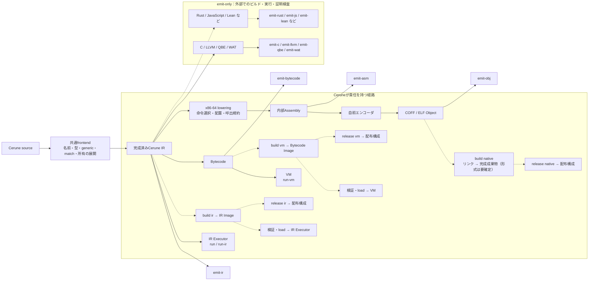

# 実行経路とbuild / releaseの責務

[English](owned-routes.en.md) · [Issue #81](https://github.com/Hokutaka/Cerune/issues/81)

## 方針と現状

Ceruneが完成成果物と実行契約を定義する経路はIR・VM・Nativeの3つです。
`build`はその経路で利用できる完成成果物を作り、`release`は配布向けに構成します。
実行方式や暗黙の最適化を選ぶ操作ではありません。

現行実装には`run`／`run-ir`、`run-vm`、各`emit-*`があります。
**build / release、Imageの保存・読み込み、Lean backendは未実装です。**
以下の図の破線は計画を示します。言語機能の対応状況は経路ごとに別途管理します。
動的配列はIR・MIR・VM・C・LLVM・QBE・WAT・Windows/Linux ASM・自前Objectで対応済みです。[IR段階設計](ir-stages.ja.md)のMIR生成・独立実行は実装済みです。これは新しいbuild／releaseの配布routeを確定するものではありません。

## 経路図

実行とImage構築は分岐します。buildのためにプログラムを実行しません。
現在の自前Object生成は内部Assemblyをエンコーダへ渡します。
図は外部アセンブラを必須にしたり、未実装の機械語IRを実装済みと示したりしません。

## 操作と完成成果物

| 操作 | 契約 |
| --- | --- |
| `emit-*` | 特定段階の表現を明示的に取り出す。観測・後続処理の入力であり、完成品とは限らない |
| `build ir` / `build vm`（計画） | 形式・意味の版、実行入口、必要な定義、資源契約、出自を持つ、load可能なImageを構築 |
| `build native`（計画） | 明示ターゲットとツール選択に基づき、Native経路で使う完成成果物を構築 |
| `release`（計画） | 対応する完成成果物、必要な依存物、manifest、互換条件を配布可能に構成 |

生成処理の共有は可能です。ただし、テキスト`.ceir`／`.cebc`やObjectに別名を付けただけでbuildとはしません。
現行のテキスト観測形式を、そのまま安定した入力形式と約束しません。
Imageの拡張子・コンテナ形式・互換性の版付けは、loader設計時に決定します。

IR・VM成果物の実行には互換ランタイムが必要です。releaseにランタイムを同梱するか、利用環境へ要求するかは明示的な配布方式にします。
Nativeの最初の完成成果物には**実行ファイルを提案**します。その場合、リンクは必須です。
ライブラリを扱う場合は別の成果物種別を明示します。この選択と外部リンカの呼出契約は未確定です。

## 外部ツールとの境界

現在のC・LLVM・QBE・WATはemit-onlyで、通常のCLIは後続ツールを管理しません。将来の`run --via`は、生成と外部実行を別の操作として扱う[#81](https://github.com/Hokutaka/Cerune/issues/81)の検討事項です。emit-onlyを永久の分類とはせず、対応環境・成果物・失敗・実行契約を管理できるかで判断します。Leanの証明器起動は引き続き別の検証作業です。
一方、**生成結果がCerune IRの意味を守る責任と、その検証はCerune側に残ります。**
Leanも同じ境界で、[意味の対応とプログラムの性質](lean-verification.ja.md)を検証します。

Nativeは外部リンカを使ってもCerune-ownedです。Ceruneが明示したツール・引数・ターゲット・ABI・必要なライブラリと、完成成果物の契約を管理します。
実行中のOSからターゲットや出力方式を黙って選びません。必要なツールの欠落、リンク失敗、対象環境での実行失敗は区別します。

開発用テストが外部ツールを起動することと、利用者向けCLIの責務は別です。
既知の期待値、IR・VMとの比較、対象環境でのNative実行を継続します。未実行の経路を成功とは数えません。

## Imageの検証と可観測性

外部からloadするImageは、実行前に次を検証します。

- 形式・意味の版、サイズ上限、必須セクション、参照の範囲。
- 型・束縛・関数・制御フロー・bytecodeのスタック整合性。
- 明示されたretain / releaseと所有・借用の不変条件。復号成功だけを妥当性の保証にしない。
- 実行入口、資源予算、必要なruntime機能と実行環境の互換条件。
- NodeId・SourceId・Spanなど、停止理由と出自を追うための対応情報。

所有の検証規則を定義できない段階では、任意のImageを受け付けるloaderを公開しません。
チェックサムは破損検出用であり、この意味検証や実行権限の代用にはなりません。

buildでも各emit境界を観測できるようにし、releaseでも停止コード・出自との対応を失わないようにします。
ソース本文の同梱は別の明示オプションにできます。最適化を導入する場合は、選択したpassと変換前後の観測を独立して設計します。
manifestには入力・Cerune・形式の識別情報、経路、ターゲット、明示オプション、外部ツールと依存物を記録します。

## 依存方向と実装順序

共通frontend・IR・runtime意味論から個別のoptional emitterへ依存させません。
emitterが共通契約を参照し、CLIが利用可能な経路を組み合わせます。現行crateの分割方法やplugin ABIを先行して固定しません。

1. 本文書で責務と未確定事項を整理する。Leanは別の検証実験から開始する。
2. Nativeの完成成果物・リンカ指定・runtime依存と、build失敗の契約を決める。
3. IR・BytecodeのImage形式、検証器、loaderを設計・実装する。
4. 3経路のbuildとreleaseを実装し、保存・再読込・配布後の実行を比較する。
5. 必要な境界からoptional emitterを分離する。

各段階にexample、異常系、観測成果物を含めます。
現行の動的配列などの経路間の未対応を、今回の分類によって解決済みとはしません。

## 未確定事項

Nativeの最初の成果物種別、リンカ設定、runtimeの同梱方式、Image形式と互換方針、buildの既定経路とCLI構文の詳細は実装前に確定します。
`build ir`等は操作を説明する仮の表記で、現行CLIへ追加済みのコマンドではありません。
